# TEC LMS System Architecture

## Overview

The Teacher Education College Learning Management System (TEC LMS) is a comprehensive digital platform designed to modernize teacher education through technology integration.

## System Architecture Diagram

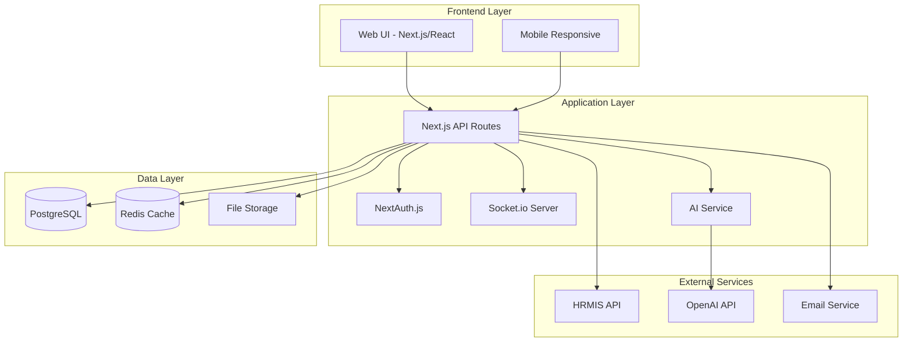

## Core Components

### 1. Learning Management System (LMS)

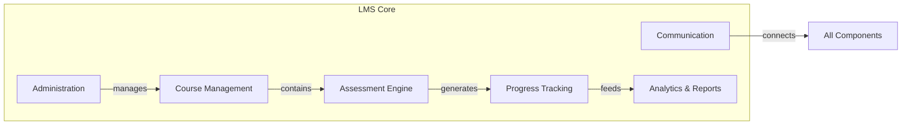

### 2. User Roles and Permissions

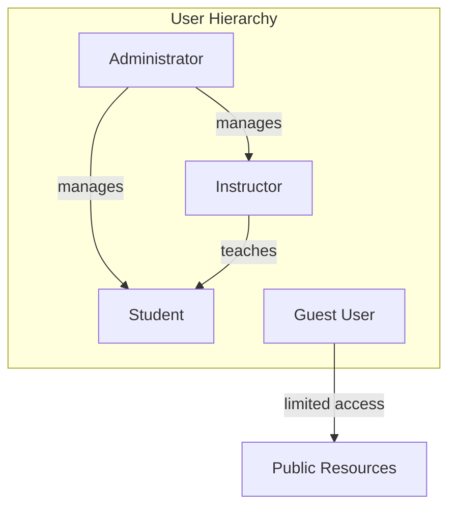

### 3. Course Structure

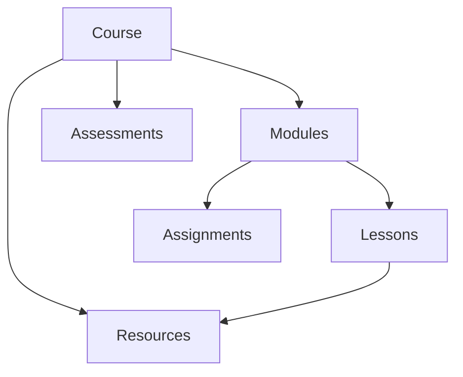

### 4. Assessment Workflow

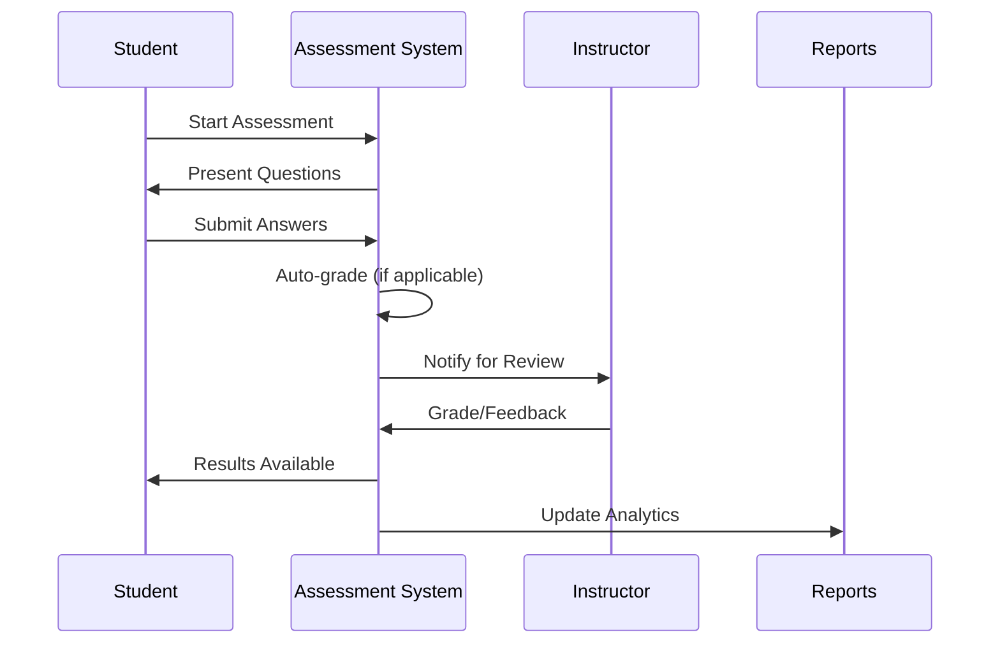

### 5. AI Chatbot Integration

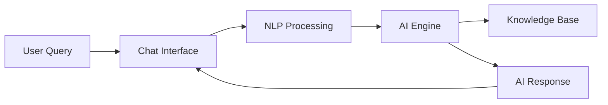

## Data Flow

### 1. Authentication Flow

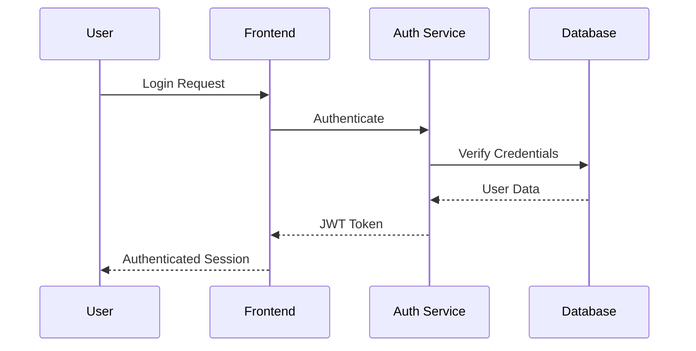

### 2. Learning Progress Tracking

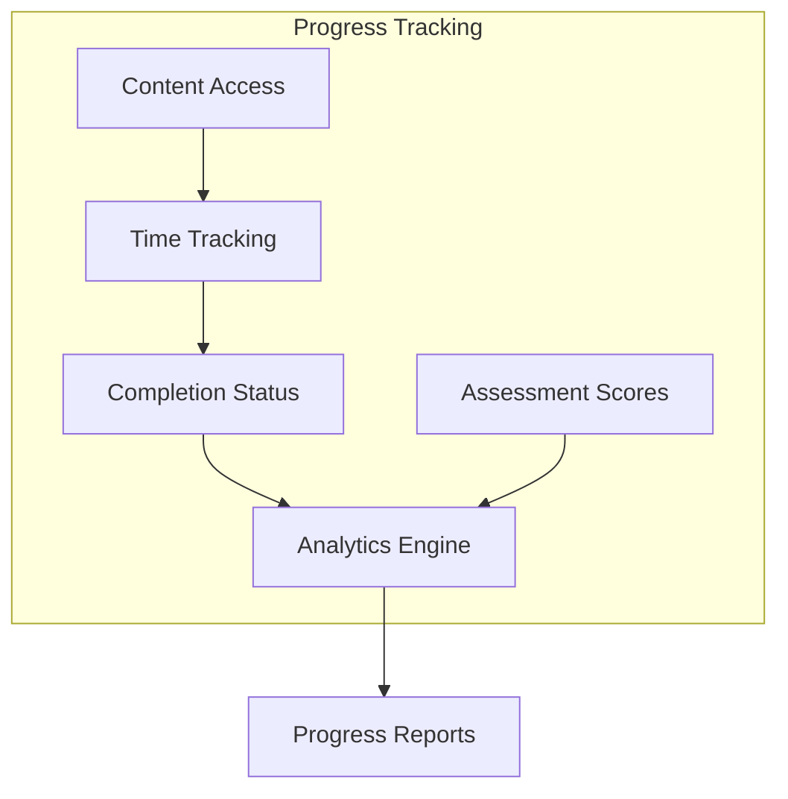

## Technology Stack Details

### Frontend
- **Next.js 14**: Server-side rendering and routing
- **React 18**: UI components and state management
- **TypeScript**: Type safety
- **Tailwind CSS**: Styling
- **Chart.js**: Data visualization
- **Socket.io Client**: Real-time features

### Backend
- **Next.js API Routes**: RESTful APIs
- **Prisma ORM**: Database management
- **NextAuth.js**: Authentication
- **Socket.io**: Real-time communication
- **OpenAI SDK**: AI integration

### Database Schema
- **PostgreSQL**: Primary database
- **Redis**: Caching and sessions
- **Prisma**: ORM and migrations

## Security Architecture

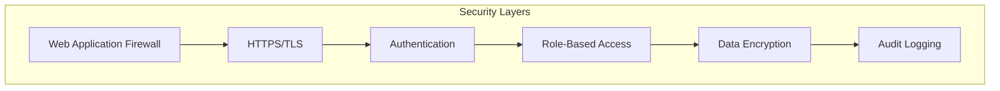

## Deployment Architecture

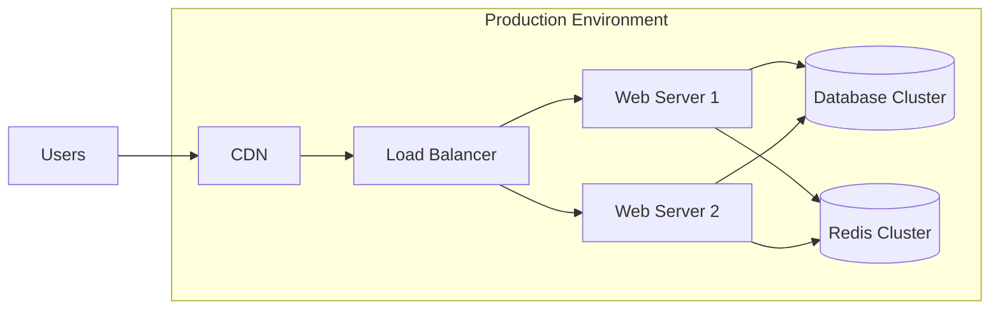

## Integration Points

### HRMIS Integration
- User synchronization
- Role mapping
- Performance data exchange
- Certification records

### External Services
- OpenAI for chatbot
- Email services for notifications
- Cloud storage for files
- Analytics services

## Monitoring and Maintenance

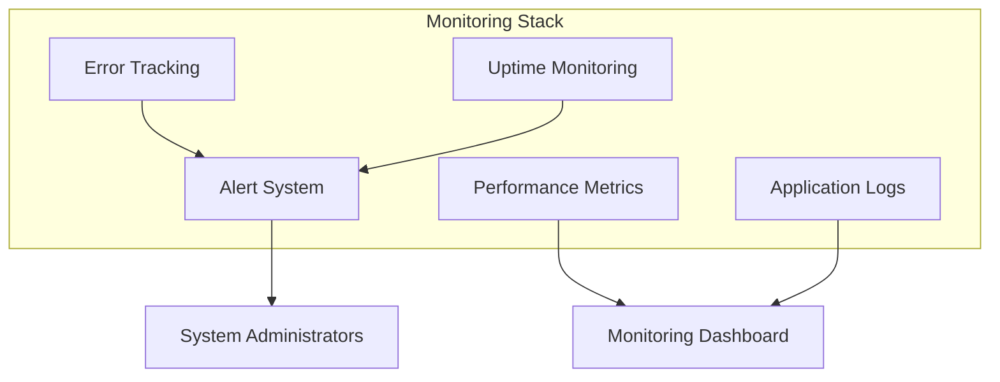

## Scalability Considerations

1. **Horizontal Scaling**: Application servers can be scaled horizontally
2. **Database Sharding**: For large datasets
3. **Caching Strategy**: Redis for frequently accessed data
4. **CDN Usage**: Static assets and media files
5. **Microservices**: AI and analytics can be separated as needed

## Disaster Recovery

1. **Database Backups**: Daily automated backups
2. **File Storage**: Redundant storage with versioning
3. **Code Repository**: Version control with Git
4. **Documentation**: Comprehensive system documentation
5. **Recovery Procedures**: Documented and tested regularly